# Github Documentation

This documentation will cover the process of managing projects and students for a semester.

## Important Information

- Each project should have its own private, protected repository that students should not have access to.
- Students should only have access to *forks* of the main project repository

## Beginning a New Semester

At the beginning of the semester, the repositories will need to be created and the students will need to have their Github accounts ready.

Start by opening up and signing into [Github.com](https://github.com).

### 1. Create Project Repository

If the students are building a new project from scratch and will not be using existing code, a new repository must be created; **otherwise, skip this step.**

1. Each project should have its main protected location. To create a new empty repository, click the `plus` icon in the top right corner, and select `New repository`
   > 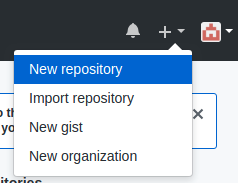

2. Github should now display a quick form to create the new project repository. Name the repository all lowercase with `-` characters in place of spaces beginning with `renova-` (e.g. `renova-[project-name]`). An example is pictured below. Be sure that all settings in the form match the below image as well.

	> 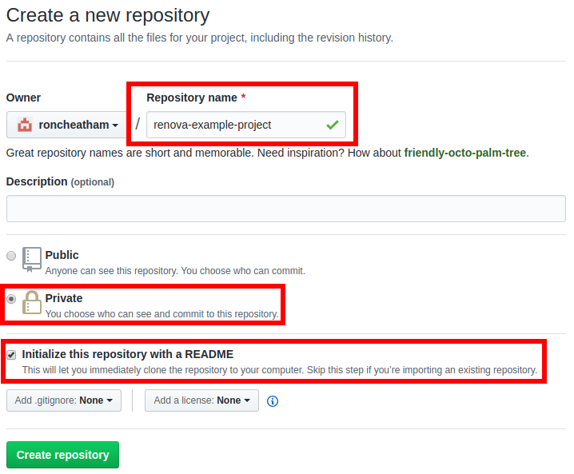

### 2. Fork Project Repository

With the project repository ready, it's now time to *fork* it to later allow the students to access it.

1. Browse over to the repository list by clicking the profile icon in the top right corner, and then click `Your repositories`.
	> 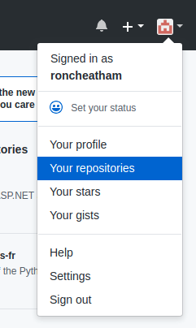

2. Click the project repository that should be forked (in this example, it is `renova-example-project`)
	> 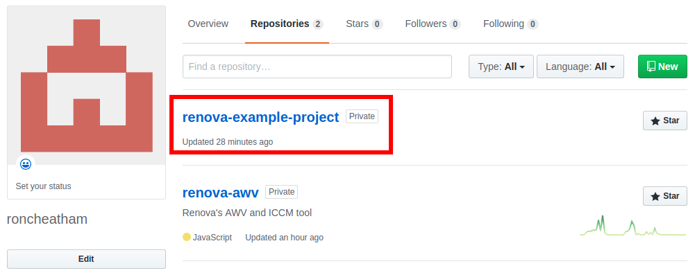

3. Click the `Fork` button in the upper-right hand corner.
	> 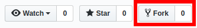

4. Click the `renovamtsu` organization to create the fork.
	> 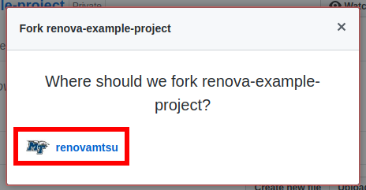

### 3. Create the Project Team

With the projects now forked and ready to be used, it's time to create the team of students to work on the project.

1. Navigate to the [renovamtsu](https://github.com/renovamtsu) by going to the profile page and then clicking the organization icon (MTSU logo) in the bottom left corner.
	> 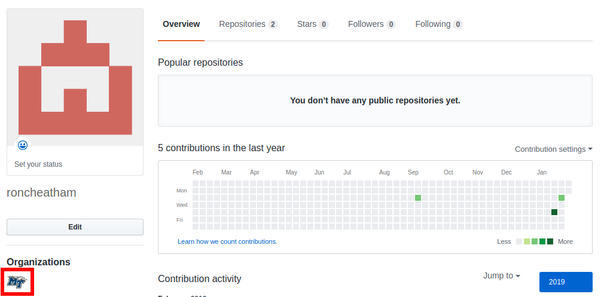

2. Click the `Teams` tab and create a new team. If it's already created, just click the team listed below. Give the team an appropriate name for the project they'll be working on.
	> 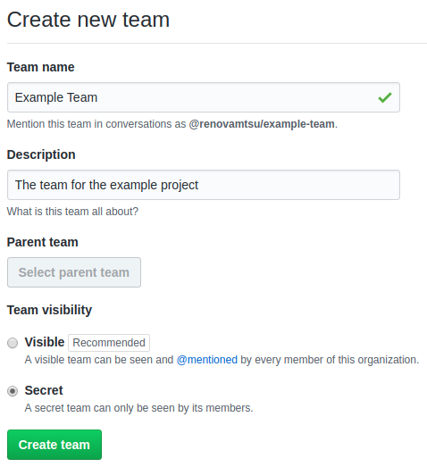

3. Next, edit the Repositories that the team has access to by clicking the `Repositories` tab and then add the project repository by clicking the `Add repository` button. Type or paste the exact name of the project repository in the dialog and then click the suggestion below to complete it. Finish by clicking `Add repository to team` button.
	> 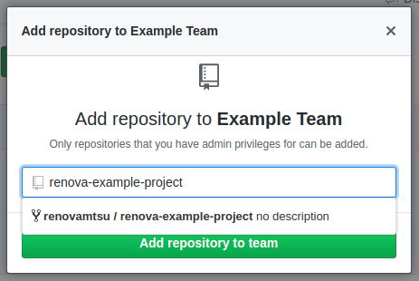

4. After the repository is added, set the team's permissions for that repository to `Write`
	> 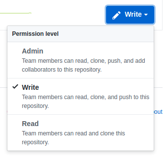

5. Finally, add the students to the team. Edit the team's members by clicking the `Members` tab and then click `Add a member`. Enter the email address for the student (avoid using usernames if possible for security reasons). Once you click their user profile it will replace the email with their username (this is fine). Do this for each student that will be apart of the project.
	> 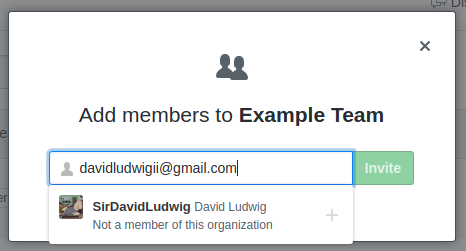

6. **Github currently only shows the invation on the organization page.** Because of this, send the students a link to the organization page after they're invited so they can accept it (e.g. https://github.com/renovamtsu).
	> 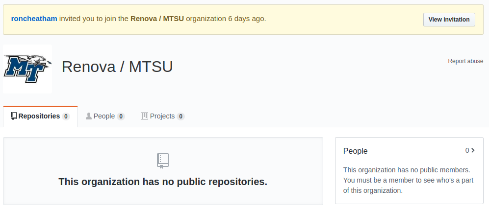

## End of Semester

- When the team is finished and will no longer be working with the project, that team can be deleted from the organization.
- After the project is finished for the semester, a Renova developer can create a pull request for the new forked repository into the original and then test out the changes.
- When the changes ready, the dev can officially merge the changes, and the forked repository on the organization can be deleted, or reused for the next semester. *Deleting and recreating the fork for each semester is highly recommended*.
